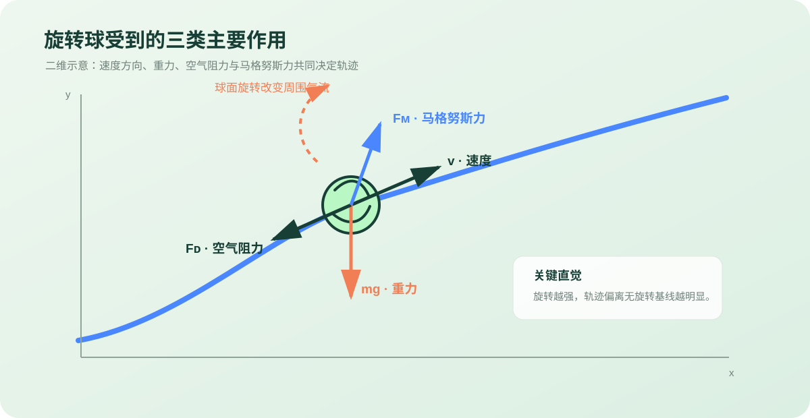
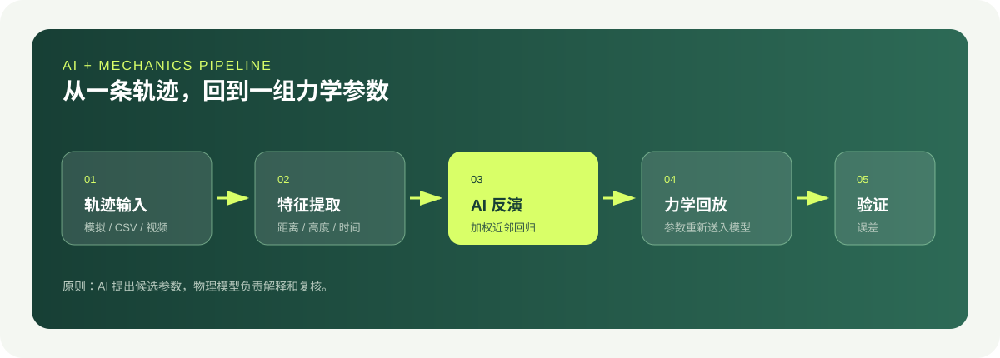

# “球为什么会拐弯？”

## 基于 AI 视觉识别与力学建模的旋转球飞行轨迹交互系统

## 目录

1. [力学问题背景](#1-力学问题背景)
2. [作品详情](#2-作品详情)
3. [AI工具信息及使用方法](#3-ai工具信息及使用方法)
4. [AI应用的实施迭代过程](#4-ai应用的实施迭代过程)
5. [结果验证](#5-结果验证)
6. [AI应用的创新点与局限性](#6-ai应用的创新点与局限性)
7. [感悟与反思](#7-感悟与反思)
8. [附录：符号说明](#8-附录符号说明)

---

## 1 力学问题背景

足球、网球、乒乓球和棒球都可能出现“带旋转后轨迹改变”的现象。球受到重力和空气阻力；当球自转时，球面附近的气流速度分布不对称，还会产生垂直于来流方向的马格努斯力。

以上旋球为例：球面上半部分的旋转方向与来流相反，下半部分与来流相同，边界层分离点不对称，尾流向一侧偏转。由动量定理，气流对球的反作用力指向另一侧，其方向近似由旋转角速度 $\boldsymbol{\omega}$ 与相对来流速度 $\boldsymbol{u}_{\mathrm{rel}}$ 的叉乘 $\boldsymbol{\omega}\times\boldsymbol{u}_{\mathrm{rel}}$ 决定。因此上旋使球下坠更快，下旋使球“飘”得更远，侧旋则产生横向弧线。

本案例关注三个问题：

1. 在球种、初速度、发射角给定时，旋转、风场和空气性质如何共同改变飞行轨迹？
2. 轨迹变化中哪些来自重力，哪些来自空气阻力和马格努斯力？
3. 能否仅凭一串轨迹点反推出一组合理的运动参数，并让这组参数重新生成轨迹、与观测进行比较？

我们把熟悉的“弧线球”转化为可交互的力学实验：网页允许用户逐项改变条件、实时观察计算结果，并把轨迹数据送入 AI 模块估计参数。重点不是让 AI 给出一个不可解释的答案，而是让估计结果回到受力模型中接受回放和误差检查。

## 2 作品详情

### 2.1 作品组成

作品由三部分组成：

| 组成 | 文件 | 作用 |
| --- | --- | --- |
| 交互网页 | `code/index.html`、`code/app.js`、`code/styles.css` | 轨迹模拟、AI 参数反演、模型检查与复杂工况演示 |
| MATLAB 实时脚本 | `magnus_trajectory_live.m`、`ai_trajectory_inference_live.m` | 离线复现网页的正向模拟和上传轨迹反演，输出图形与 `ai_inference_result.mat` |
| 数据与图件 | `data/*.csv`、`figure/*.svg` | 示范轨迹、合成测试轨迹、公开数据样例、原理图与流程图 |

网页分为五个连续模块：01「建立轨迹」模拟器，02「AI INFERENCE」参数反演，03「CHECK & LIMITS」模型检查，04「COMPLEX CASES」复杂工况，05「METHOD NOTES」方法说明。参数滑块改变后，轨迹和诊断量即时更新；“参数重置”和“播放飞行过程”用于恢复默认条件和展示运动过程。

### 2.2 交互功能

模拟器默认使用网球，初速度 $U_0=22\ \mathrm{m/s}$、发射角 $\theta_0=45^\circ$、自转 $1200\ \mathrm{rpm}$，初始位置位于坐标原点。用户可切换网球、足球、乒乓球和光滑参考球，选择二维基线或三维观测，并调整风速、空气密度、阵风、旋转衰减率、旋转轴倾角与方位角、侧向风速等参数。网页同时显示“无空气”“仅空气阻力”“阻力 + 旋转”三组计算结果，便于比较各因素的影响。

三维轨迹窗以 $X$ 表示前进方向、$Y$ 表示侧向方向、$Z$ 表示竖直高度。网页标出落点到原点的水平距离、落点在 $X/Y$ 方向的投影，以及最高点的高度和其在 $XY$ 平面的投影距离。（程序内部积分状态为 $(x,y,z)$，其中内部 $y$ 为高度、内部 $z$ 为侧向位移，绘图时映射为显示坐标 $Z$ 和 $Y$。）

摘要量包括落点距离、最高点、飞行时间、横向偏移和“旋转抬升”：

$$
\Delta h_{\mathrm{spin}} = h_{\max}^{\mathrm{full}} - h_{\max}^{\mathrm{drag}}
$$

式中，$\Delta h_{\mathrm{spin}}$ 为旋转抬升（m）；$h_{\max}^{\mathrm{full}}$ 为“阻力 + 旋转”完整模型的最高点高度（m）；$h_{\max}^{\mathrm{drag}}$ 为“仅空气阻力”模型的最高点高度（m）。诊断区显示初始 Reynolds 数 $Re$、旋转参数 $S$、升力系数 $C_L$、阻力系数 $C_D$、升阻比 $C_L/C_D$ 和浮力/重力比 $F_B/(mg)$。

### 2.3 力学模型

设球质量为 $m$，半径为 $R$，直径 $D=2R$，迎风面积 $A=\pi R^2$，体积 $V=\tfrac{4}{3}\pi R^3$；空气密度为 $\rho$，动力黏度 $\mu=1.81\times10^{-5}\ \mathrm{Pa\cdot s}$；$\boldsymbol{e}_h$ 为竖直向上的单位向量。

**（1）相对速度、动压与无量纲参数**

$$
\boldsymbol{u}_{\mathrm{rel}} = \boldsymbol{v} - \boldsymbol{u}_{\mathrm{air}}, \qquad
q = \frac{1}{2}\rho\,\lvert\boldsymbol{u}_{\mathrm{rel}}\rvert^{2}
$$

$$
Re = \frac{\rho\,\lvert\boldsymbol{u}_{\mathrm{rel}}\rvert\,D}{\mu}, \qquad
S = \frac{\lvert\boldsymbol{\omega}\rvert\,R}{\lvert\boldsymbol{u}_{\mathrm{rel}}\rvert}
$$

式中，$\boldsymbol{u}_{\mathrm{rel}}$ 为球相对空气的速度（m/s）；$\boldsymbol{v}$ 为球的绝对速度（m/s）；$\boldsymbol{u}_{\mathrm{air}}$ 为当地风速（m/s）；$q$ 为动压（Pa）；$Re$ 为 Reynolds 数，表示惯性力与黏性力之比；$S$ 为旋转参数，表示球面切向速度 $\lvert\boldsymbol{\omega}\rvert R$ 与来流速度之比；$\boldsymbol{\omega}$ 为自转角速度向量（rad/s）。

**（2）受力**

$$
\boldsymbol{F}_D = -\,q\,C_D\,A\,\frac{\boldsymbol{u}_{\mathrm{rel}}}{\lvert\boldsymbol{u}_{\mathrm{rel}}\rvert}, \qquad
\boldsymbol{F}_B = \rho\,V\,g\,\boldsymbol{e}_h
$$

$$
\boldsymbol{F}_M = q\,C_L\,A\,\frac{\boldsymbol{\omega}\times\boldsymbol{u}_{\mathrm{rel}}}{\lvert\boldsymbol{\omega}\times\boldsymbol{u}_{\mathrm{rel}}\rvert}
$$

式中，$\boldsymbol{F}_D$ 为空气阻力（N），方向与相对速度相反；$\boldsymbol{F}_B$ 为浮力（N），竖直向上；$\boldsymbol{F}_M$ 为马格努斯力（N），方向垂直于旋转轴和相对来流；$C_D$ 为阻力系数；$C_L$ 为升力系数；$g=9.81\ \mathrm{m/s^2}$ 为重力加速度。

二维模式中，马格努斯力取平面内与相对速度垂直的方向：

$$
\boldsymbol{F}_M^{\mathrm{2D}} = q\,C_L\,A\,\frac{\left(-u_{\mathrm{rel},y},\ u_{\mathrm{rel},x}\right)}{\lvert\boldsymbol{u}_{\mathrm{rel}}\rvert}
$$

式中，$u_{\mathrm{rel},x}$、$u_{\mathrm{rel},y}$ 分别为相对速度在前进方向和竖直方向的分量（m/s）；向量 $\left(-u_{\mathrm{rel},y},\ u_{\mathrm{rel},x}\right)$ 是相对速度逆时针旋转 $90^\circ$ 后的方向，$C_L>0$ 对应下旋（升力向上），$C_L<0$ 对应上旋（升力向下）。

**（3）运动方程**

$$
m\,\frac{\mathrm{d}\boldsymbol{v}}{\mathrm{d}t} = -\,m g\,\boldsymbol{e}_h + \boldsymbol{F}_D + \boldsymbol{F}_B + \boldsymbol{F}_M, \qquad
\frac{\mathrm{d}\boldsymbol{r}}{\mathrm{d}t} = \boldsymbol{v}
$$

式中，$\boldsymbol{r}$ 为球心位置向量（m）；$t$ 为时间（s）；$m$ 为球的质量（kg）。初始条件为 $\boldsymbol{r}(0)=\boldsymbol{0}$，$\boldsymbol{v}(0)=U_0\left(\cos\theta_0,\ \sin\theta_0,\ 0\right)^{\mathrm{T}}$，其中 $U_0$ 为初速度大小（m/s），$\theta_0$ 为发射角（与水平面夹角）。

**（4）气动系数**

基础模式采用常系数近似，升力系数与转速 $n$（rpm）成正比并限幅：

$$
C_L^{\mathrm{basic}} = \operatorname{clamp}\!\left(1.15\times10^{-4}\,n,\ -0.34,\ 0.34\right)
$$

式中，$n$ 为自转速度（rpm），正值表示下旋；$\operatorname{clamp}(x,a,b)$ 表示把 $x$ 限制在区间 $[a,b]$ 内，即 $\min\!\left(\max(x,a),b\right)$。

进阶模式中，升力系数随旋转参数增大并逐渐饱和：

$$
C_L^{\mathrm{adv}} = \operatorname{clamp}\!\left(\operatorname{sgn}(S)\,\frac{1.55\,\lvert S\rvert}{1+1.8\,\lvert S\rvert},\ -0.72,\ 0.72\right)
$$

式中，$\operatorname{sgn}(S)$ 为符号函数，用于保留旋转方向；$S$ 较小时 $C_L\approx1.55\,S$，近似线性增长，$S$ 较大时趋于饱和。

普通球类使用代表性 $C_D$；只有光滑参考球启用 Morrison 型球体阻力关联式：

$$
C_D(Re) = \frac{24}{Re} + \frac{2.6\,(Re/5)}{1+(Re/5)^{1.52}} + \frac{0.411\,(Re/263000)^{-7.94}}{1+(Re/263000)^{-8}} + \frac{Re^{0.8}}{461000}
$$

式中，第一项 $24/Re$ 对应低 $Re$ 下的 Stokes 阻力；第三项描述 $Re\approx2.63\times10^{5}$ 附近边界层转捩引起的“阻力危机”；计算结果限制在 $[0.08,\ 30]$ 内。

**（5）进阶模式的环境与旋转修正**

高度相关空气密度（$R_{\mathrm{air}}=287.05\ \mathrm{J/(kg\cdot K)}$，$T=288.15\ \mathrm{K}$）：

$$
\rho(h) = \rho_0 \exp\!\left[-\frac{g\,\max(h,0)}{R_{\mathrm{air}}\,T}\right]
$$

式中，$\rho(h)$ 为高度 $h$ 处的空气密度（kg/m³）；$\rho_0$ 为发射点空气密度（kg/m³，默认 1.225）；$h$ 为球心高度（m）；$R_{\mathrm{air}}$ 为空气气体常数；$T$ 为空气温度（K）。该式为等温大气近似。

前进方向风场包含平均风 $w_0$、周期阵风 $A_g$ 和线性风切变，侧向风包含侧向平均风 $w_{\mathrm{lat}}$ 和阵风分量：

$$
u_{\mathrm{air},x} = w_0 + A_g\sin\!\left(2\pi\cdot0.65\,t + 0.12\max(h,0)\right) + 0.025\,w_0\max(h,0)
$$

$$
u_{\mathrm{air},\mathrm{lat}} = w_{\mathrm{lat}} + 0.35\,A_g\cos\!\left(2\pi\cdot0.55\,t\right)
$$

式中，$u_{\mathrm{air},x}$、$u_{\mathrm{air},\mathrm{lat}}$ 分别为前进方向和侧向的风速分量（m/s）；$w_0$ 为前进方向平均风速（m/s，顺风为正）；$w_{\mathrm{lat}}$ 为侧向平均风速（m/s）；$A_g$ 为阵风幅值（m/s）；$0.65\ \mathrm{Hz}$、$0.55\ \mathrm{Hz}$ 为阵风频率；$0.025\,w_0\max(h,0)$ 表示风速随高度线性增大的风切变。竖直方向风速取 0。

自转按指数衰减，旋转轴由倾角 $\theta_s$ 与方位角 $\varphi_s$ 确定：

$$
\boldsymbol{\omega}(t) = \omega_0\,e^{-\lambda t}
\begin{pmatrix}
\sin\theta_s\cos\varphi_s \\
\sin\theta_s\sin\varphi_s \\
\cos\theta_s
\end{pmatrix}
$$

式中，$\omega_0=2\pi n/60$ 为初始角速度大小（rad/s）；$\lambda$ 为旋转衰减率（$\mathrm{s^{-1}}$，默认 0.40）；$\theta_s$ 为旋转轴倾角，$\theta_s=0$ 时旋转轴沿侧向，产生纯上/下旋；$\varphi_s$ 为旋转轴方位角。基础模式取 $\lambda=0$。风改变的是相对速度的大小和方向，因此会同时影响动压、$Re$、阻力和升力方向，而不只是把整条轨迹平移。

**（6）数值积分**

将状态向量记为 $\boldsymbol{s}=(\boldsymbol{r},\boldsymbol{v})^{\mathrm{T}}$，$\dot{\boldsymbol{s}}=\boldsymbol{f}(t,\boldsymbol{s})$，采用四阶 Runge–Kutta 方法：

$$
\boldsymbol{s}_{\ell+1} = \boldsymbol{s}_\ell + \frac{\Delta t}{6}\left(\boldsymbol{k}_1 + 2\boldsymbol{k}_2 + 2\boldsymbol{k}_3 + \boldsymbol{k}_4\right)
$$

$$
\boldsymbol{k}_1=\boldsymbol{f}(t_\ell,\boldsymbol{s}_\ell),\quad
\boldsymbol{k}_2=\boldsymbol{f}\!\left(t_\ell+\tfrac{\Delta t}{2},\boldsymbol{s}_\ell+\tfrac{\Delta t}{2}\boldsymbol{k}_1\right),\quad
\boldsymbol{k}_3=\boldsymbol{f}\!\left(t_\ell+\tfrac{\Delta t}{2},\boldsymbol{s}_\ell+\tfrac{\Delta t}{2}\boldsymbol{k}_2\right),\quad
\boldsymbol{k}_4=\boldsymbol{f}(t_\ell+\Delta t,\boldsymbol{s}_\ell+\Delta t\,\boldsymbol{k}_3)
$$

式中，$\boldsymbol{s}_\ell$ 为第 $\ell$ 步的状态向量；$t_\ell$ 为第 $\ell$ 步的时刻；$\Delta t$ 为时间步长（s）；$\boldsymbol{f}$ 为由运动方程给出的状态导数 $(\boldsymbol{v},\ \mathrm{d}\boldsymbol{v}/\mathrm{d}t)$；$\boldsymbol{k}_1\sim\boldsymbol{k}_4$ 为一个步长内四个位置的斜率估计。网页默认 $\Delta t = 0.008\ \mathrm{s}$，最长计算 $8\ \mathrm{s}$，并与 $\Delta t/2$ 的结果作敏感性比较。

### 2.4 复杂工况

复杂工况区提供静风基线、横风扰动、旋转衰减和低密度空气四种预设，帮助观察参数耦合，而非孤立的单一力效应。例如低密度空气同时减小 $q$ 和 $Re$，阻力和马格努斯力一起减弱；旋转衰减使 $S$ 和 $C_L$ 沿飞行过程下降，轨迹后段更接近纯阻力情形。

### 2.5 数据入口与可视化

AI 区域提供“反演当前轨迹”“上传实验轨迹”和“载入示范数据”三个并列入口。输入轨迹以红色显示，AI 参数回放以蓝色显示，并报告估计的初速度、发射角、$C_D$、自转和回放 RMSE。

CSV 字段为 `time_s,x_m,y_m`，单位为秒、米、米，$y$ 轴必须向上。系统按时间排序并去重，将首个有效点平移到原点；从第二个点开始，在首次回到首点高度（归一化后 $y\le0$）处截断，只保留自由飞行段。若视频坐标 $y$ 轴向下，或尚未完成像素—米标定，必须先离线翻转并换算坐标。系统当前只读取轨迹 CSV，不直接从视频中识别球心。

## 3 AI工具信息及使用方法

本次使用的 AI 工具分为两类：一类是辅助完成建模、编程和写作的 **AI 开发工具**；另一类是作品内部用于参数反演的 **AI 算法模块**。

### 3.1 AI 开发辅助工具

| 工具 | 版本/访问方式 | 主要用途 | 使用方式 |
| --- | --- | --- | --- |
| 【请填写，如 Claude Code / ChatGPT / Copilot 等】 | 【版本、使用日期】 | 生成网页与 MATLAB 代码框架、调试数值积分与拟合程序 | 由团队给出力学模型、坐标约定和参数范围，AI 生成代码；团队逐项审阅并修改 |
| 【请填写】 | 【版本、使用日期】 | 查阅马格努斯效应、球体阻力关联式等资料，润色报告文字 | AI 给出的公式与数据均回到教材、文献或程序结果中核对 |

使用原则：AI 生成的代码和文字只作为草稿，所有公式、参数和数值结论都经过第 5 节的检查后才写入作品；不将未经核实的 AI 输出直接作为结果。

### 3.2 作品内置的 AI 算法模块

网页由原生 HTML、CSS 和 JavaScript 构成，使用 Canvas 绘制轨迹，不依赖在线 AI 接口或第三方前端框架。AI 模块不是大语言模型，而是以数值轨迹为输入、以力学模型为约束的轻量参数估计器。根据入口不同，采用两条路径：

**（1）当前模拟轨迹：加权 K 近邻回归（KNN）**

从轨迹提取特征向量 $\boldsymbol{f}$（水平射程、最大高度、飞行时间、初始方向、末端速度、几何曲率等），在由物理模型生成的样本库中检索。普通球类样本库为 $5\times5\times5\times5=625$ 组参数组合：

$$
U_0\in\{14,18,22,26,30\}\ \mathrm{m/s},\quad
\theta_0\in\{10^\circ,18^\circ,26^\circ,34^\circ,42^\circ\},\quad
n\in\{0,\pm1100,\pm2200\}\ \mathrm{rpm},\quad
C_D\in\{0.18,0.28,0.42,0.56,0.68\}
$$

光滑参考球的 $C_D$ 由 $Re$ 关联式给定，样本库为 125 组。样本库随当前球种、物理模式、空气密度、风速、阵风和旋转衰减率重新生成。归一化特征距离与权重为：

$$
d_j = \sqrt{\sum_{i}\left(\frac{f_{j,i}-f_i^{*}}{f_i^{\max}-f_i^{\min}}\right)^{2}}, \qquad
w_j = \frac{1}{0.02 + d_j}
$$

式中，$d_j$ 为待估轨迹与第 $j$ 个样本的归一化特征距离；$f_i^{*}$ 为待估轨迹的第 $i$ 个特征；$f_{j,i}$ 为第 $j$ 个样本的第 $i$ 个特征；$f_i^{\max}$、$f_i^{\min}$ 为样本库中该特征的最大值和最小值，用于消除不同特征量纲的影响；$w_j$ 为样本权重，常数 0.02 用于避免距离为 0 时权重发散。

取距离最小的 $K=9$ 个样本，对参数 $\boldsymbol{p}=(U_0,\theta_0,n,C_D)$ 加权平均：

$$
\hat{\boldsymbol{p}} = \frac{\sum_{j=1}^{9} w_j\,\boldsymbol{p}_j}{\sum_{j=1}^{9} w_j}, \qquad
\text{近邻相似度} = \min\!\left(e^{-\bar d},\ 0.99\right)
$$

式中，$\boldsymbol{p}_j$ 为第 $j$ 个近邻样本的参数向量；$\hat{\boldsymbol{p}}$ 为估计参数；$\bar d$ 为 9 个近邻距离的平均值。

**（2）上传 CSV 与示范数据：动力学直接拟合**

对清洗后的轨迹均匀抽取不超过 80 个点，在约束区间内求解：

$$
\min_{\boldsymbol{p}}\ J(\boldsymbol{p}) = \sqrt{\frac{1}{N}\sum_{k=1}^{N} c_k\left\lVert \boldsymbol{r}_k^{\mathrm{obs}} - \boldsymbol{r}^{\mathrm{sim}}(t_k;\boldsymbol{p})\right\rVert^{2}} + 0.65\,\max\!\left(0,\ t_N^{\mathrm{obs}} - t_{\mathrm{end}}^{\mathrm{sim}}\right)
$$

$$
U_0\in[8,36]\ \mathrm{m/s},\quad \theta_0\in[5^\circ,75^\circ],\quad n\in[-2600,2600]\ \mathrm{rpm},\quad C_D\in[0.12,0.80]
$$

式中，$J(\boldsymbol{p})$ 为目标函数（m）；$N$ 为参与拟合的抽样点数（$N\le80$）；$\boldsymbol{r}_k^{\mathrm{obs}}$ 为第 $k$ 个观测点坐标；$\boldsymbol{r}^{\mathrm{sim}}(t_k;\boldsymbol{p})$ 为参数 $\boldsymbol{p}$ 下模型在 $t_k$ 时刻的位置（由回放轨迹线性插值得到）；$c_k$ 为点权重，末点 $c_N=1.35$，其余 $c_k=1$；$t_N^{\mathrm{obs}}$ 为观测结束时刻；$t_{\mathrm{end}}^{\mathrm{sim}}$ 为回放轨迹落地时刻。第二项惩罚“回放轨迹提前落地”。求解时先用 $4\times4\times5\times4=320$ 组网格起点及由初始速度估计的起点进行粗筛，再从最优的若干起点出发进行 Nelder–Mead 单纯形优化；最后用全部清洗点计算 RMSE：

$$
\mathrm{RMSE} = \sqrt{\frac{1}{M}\sum_{k=1}^{M}\left\lVert \boldsymbol{r}_k^{\mathrm{obs}} - \boldsymbol{r}^{\mathrm{sim}}(t_k;\hat{\boldsymbol{p}})\right\rVert^{2}}
$$

式中，$M$ 为清洗后的全部观测点数；$\hat{\boldsymbol{p}}$ 为拟合得到的最优参数。网页显示的“拟合质量”为 $\min\!\left(e^{-\mathrm{RMSE}/L},\ 0.99\right)$，其中 $L=\max\!\left(0.02,\ 0.025\max_k\lVert\boldsymbol{r}_k\rVert\right)$ 为与轨迹尺度相关的误差参考长度（m）。球种、风速、密度、阵风、旋转衰减和物理模式作为已知条件，不在这一步同时反演。

需要说明：上传拟合目前在 $x$–高度二维平面内进行，不识别侧向位移，也不估计旋转轴方向；KNN 的“近邻相似度”和拟合路径的“拟合质量”都是由距离或误差映射得到的匹配指标，不是统计置信区间。

### 3.3 使用方法

1. 在项目根目录运行 `npx --yes serve .` 或 `python -m http.server 8000`，浏览器打开 `/code/`。
2. 在 01 模拟器中设置球种、观测维度和空气/旋转参数，观察三种力学条件下的轨迹与诊断值。
3. 点击“反演当前轨迹”，查看 KNN 估计结果及力学回放。
4. 点击“上传实验轨迹”选择 CSV（至少 8 个有效自由飞行点），或点击“载入示范数据”，运行动力学直接拟合。
5. 对照输入曲线、AI 回放曲线和 RMSE。若误差较大，先检查坐标方向、单位、起始点、落地截断及球种/环境设置，再判断模型是否适用。
6. 如需离线复现，在 MATLAB R2020b 及以上版本运行 `magnus_trajectory_live.m`（正向模拟）和 `ai_trajectory_inference_live.m`（上传轨迹反演，默认读取 `data/test_fit_observation.csv`，结果保存为 `ai_inference_result.mat`），无需 Optimization Toolbox。

## 4 AI应用的实施迭代过程

| 阶段 | 目标 | AI 的作用 | 发现的问题与修正 |
| --- | --- | --- | --- |
| 一：现象→模型 | 建立无空气、仅阻力、阻力 + 旋转三种工况 | 辅助生成 RK4 积分与绘图代码 | 统一坐标约定和角度单位，用真空解析解检查积分实现 |
| 二：加入 AI 估计 | 由轨迹特征反推参数 | 生成样本库与 KNN 代码 | 估计值只显示数字不可信，改为把参数送回模型生成回放曲线 |
| 三：开放外部数据 | 支持用户 CSV | 辅助编写数据清洗与优化程序 | KNN 对外部轨迹受样本网格范围限制，误差偏大；改为多起点 + Nelder–Mead 直接拟合，KNN 只保留给内部轨迹 |
| 四：三维与边界诊断 | 加入旋转轴方向、侧向风、三维观测 | 辅助实现叉乘形式马格努斯力和三维绘图 | 增加落点/最高点投影标注、步长敏感性检查、模型限制说明和复杂工况预设 |
| 五：离线复现 | 结果可在网页之外复核 | 辅助把网页算法移植到 MATLAB | 两端使用相同公式、参数区间和抽样规则，用合成数据对比结果 |

**第一阶段：从现象转为可计算模型。** 将“旋转会改变轨迹”转化为初速度、角度、旋转和气动参数可调的初值问题，以 RK4 逐步积分并同时绘出三种工况。

**第二阶段：加入可解释的 AI 参数估计。** 为当前模拟轨迹生成参数化物理样本，按轨迹特征进行 KNN 检索和加权估计，并让估计参数重新驱动力学模型生成回放曲线，使 AI 输出可以直观对照。

**第三阶段：开放轨迹文件并改为直接拟合。** 加入 CSV 上传、坐标归一化、重复时间清理和自由飞行段截断。测试中发现 KNN 对外部轨迹的匹配受样本网格范围和特征差异影响较大，因此对上传/示范轨迹改用受物理模型约束的四参数多起点拟合。

**第四阶段：从二维扩展到三维观察和边界诊断。** 加入旋转轴倾角/方位角、侧向风和三维轨迹窗；验证区加入真空斜抛解析解比较、RK4 步长敏感性检查和模型限制说明。

**第五阶段：MATLAB 离线复现。** 编写两个 MATLAB 实时脚本，与网页共享模型和参数，用于生成报告图形和可复核的数值结果。

## 5 结果验证

本次对 AI 辅助生成的系统以及反演结果进行了分层验证：先验证程序实现（公式与积分是否正确），再验证反演算法（能否找回已知参数），最后说明真实数据验证的现状与边界。

### 5.1 程序实现的可复核检查

**（1）真空解析解对照。** 关闭空气动力后，数值轨迹应与斜抛解析解一致：

$$
x(t) = U_0\cos\theta_0\,t, \qquad
h(t) = U_0\sin\theta_0\,t - \frac{1}{2}g t^{2}
$$

$$
T = \frac{2U_0\sin\theta_0}{g}, \qquad
L = \frac{U_0^{2}\sin 2\theta_0}{g}, \qquad
H = \frac{U_0^{2}\sin^{2}\theta_0}{2g}
$$

式中，$x(t)$、$h(t)$ 为水平位移和高度（m）；$T$ 为飞行时间（s）；$L$ 为射程（m）；$H$ 为最大高度（m）。以默认 $U_0=22\ \mathrm{m/s}$、$\theta_0=45^\circ$ 计算，$L\approx49.34\ \mathrm{m}$、$H\approx12.34\ \mathrm{m}$、$T\approx3.17\ \mathrm{s}$。网页在误差小于 $0.1\ \mathrm{m}$ 时显示“通过”。该检查用于发现运动方程、角度单位或积分实现错误，不代表真实球体的空气动力准确度。

**（2）步长敏感性。** 比较 $\Delta t=0.008\ \mathrm{s}$ 与 $\Delta t/2=0.004\ \mathrm{s}$ 的空间轨迹 RMSE。RK4 的全局截断误差为 $O(\Delta t^{4})$，步长减半后差异应很小；这是对数值离散误差的检查，不是对真实实验的验证。

**（3）量纲与量级检查。** 以网球为例（$m=0.057\ \mathrm{kg}$，$R=0.0335\ \mathrm{m}$，$\rho=1.225\ \mathrm{kg/m^3}$）：

$$
\frac{F_B}{mg} = \frac{\rho V}{m} = \frac{1.225\times\tfrac{4}{3}\pi\times0.0335^{3}}{0.057}\approx 3.4\times10^{-3}
$$

式中，$V$ 为球的体积（m³），$\rho V$ 为排开空气的质量（kg）。浮力只占重力约 0.3%，与常识一致；初始 $Re=\rho U_0 D/\mu\approx1.0\times10^{5}$，处于湍流过渡附近，说明使用代表性 $C_D$ 而非 Stokes 阻力是合理的。

**（4）力学规律定性检查。** 自转为 0 时“阻力 + 旋转”曲线与“仅阻力”曲线重合；正向（下旋）自转使最高点和射程增加，反向（上旋）使轨迹下沉；无风时侧向偏移仅由旋转轴倾斜产生，符合 $\boldsymbol{\omega}\times\boldsymbol{u}_{\mathrm{rel}}$ 的方向规律。

### 5.2 合成轨迹的反演测试

使用 `data/test_fit_observation.csv` 运行 `ai_trajectory_inference_live.m`：清洗后保留 375 个自由飞行点，抽取 80 个点参与优化，RMSE 用全部输入点计算。

| 参数 | 生成值（真值） | 反演值 | 相对误差 |
| --- | --- | --- | --- |
| 初速度 $U_0$ / (m/s) | 24 | 23.997 | 0.01% |
| 发射角 $\theta_0$ / (°) | 38 | 38.172 | 0.45% |
| 自转 $n$ / rpm | 1500 | 1460.7 | 2.6% |
| 阻力系数 $C_D$ | 0.62 | 0.61889 | 0.18% |
| 全量 RMSE / m | — | 0.02284 | — |

初速度和发射角主要由轨迹初段决定，辨识精度最高；自转只通过 $C_L(S)$ 间接影响轨迹，且与 $C_D$ 存在一定耦合，因此相对误差最大。这组结果说明代码能够在与自身物理模型一致的合成数据上找回接近的参数；数据由程序模拟并加入小幅确定性扰动，不是高速摄影实测，不能据此声称模型具有同等的真实预测精度。

### 5.3 公开数据的使用边界

`data/public_tt3d_sample.csv` 来自公开 TT3D 仓库评估目录中的一个三维乒乓球轨迹样例，本地保留时间、$X$ 和 $Z$（映射为网页二维字段 $y$），舍弃原始深度坐标 $Y$。样例仅 75 个记录点，包含反弹前后数据且覆盖范围较短；碰撞冲量不在当前飞行方程内，因此它适合检查 CSV 流程和说明模型边界，不作为自由飞行精度验证集。来源、字段转换及许可核查提醒见 `data/public_tt3d_metadata.json`。

目前尚无团队自采的高速摄影轨迹，真实球体上的定量外部验证尚未完成。正式实验应先完成长度标定与坐标转换，使用同一球种和记录条件多次拍摄，报告重复试验误差后，再评估模型的教学或工程适用范围。

## 6 AI应用的创新点与局限性

### 6.1 AI应用的创新点

1. **问题驱动的交互探究。** 从“球为什么会拐弯”这一日常现象出发，把受力分析、无量纲参数 $Re$、$S$、轨迹和误差连接成可以亲手操作的探究过程。
2. **物理约束的 AI 反演。** AI 不直接“猜答案”，而是在力学模型生成的样本库中检索，或以运动方程为约束进行拟合；所有估计参数都回到模型中生成回放曲线并报告 RMSE，形成“估计—回放—检验”闭环。
3. **按数据来源选择算法。** 内部模拟轨迹使用快速、可解释的 KNN；外部上传轨迹使用不受样本网格限制的动力学直接拟合。
4. **二维对照与三维观察并置。** 引入旋转轴方向和侧向风，显示落点、最高点及其平面投影，帮助区分前进距离与侧向偏移。
5. **证据分级与可复现。** 明确区分解析解检查、合成测试、公开数据和未来实测数据；网页与 MATLAB 脚本共享同一模型，评委可离线复核。

### 6.2 AI应用的局限性

1. **尚无视觉识别模块。** 当前网页不含视频目标检测，输入须预先转换为带尺度的坐标 CSV。
2. **反演维度有限。** 上传拟合为二维问题，不能识别侧向坐标、旋转轴方向和球体姿态；KNN 也只用 $x$–高度特征。三维显示不等于完成了三维反演。
3. **气动模型简化。** 风场、旋转衰减、$C_L(S)$ 和空气密度均采用简化关系；常见球类 $C_D$ 为代表值，光滑球关联式不能替代网球绒毛、足球缝线或乒乓球表面的实测数据。
4. **参数可辨识性。** 初速度、旋转和阻力之间存在耦合；观测时间短、噪声大或轨迹不完整时，多组参数可能产生相近曲线。当前评分不是参数置信区间。
5. **缺少独立实测验证。** 公开轨迹的投影丢失了一个空间方向，反弹段包含未建模的碰撞；合成数据闭环验证不能替代独立实测。

后续工作应优先完成手机慢动作拍摄与米制标定，采集不同球种、旋转方向和风况下的重复轨迹；再用实测数据校准 $C_D$、$C_L(S)$ 关系，评估参数可辨识性，并视数据质量扩展到三维拟合和视频球心自动识别。

## 7 感悟与反思

这个案例让我们看到，AI 与力学的结合并不是把公式交给模型后等待答案。只有先说明坐标、单位、受力项和适用条件，参数估计才有物理含义；只有把估计参数重新送回运动方程，并与输入轨迹比较，才构成可以复核的分析闭环。

在开发过程中，AI 编程工具显著缩短了写代码和调界面的时间，但它也可能给出方向错误的叉乘、单位混用的角度或看似合理却未经验证的系数。解析解对照、步长检查和量级估算，正是用来发现这类问题的手段。我们体会到：AI 可以加快“做出来”，而“做对了”仍要靠力学知识来判断。

我们也认识到，界面丰富不等于证据充分。二维拟合、三维可视化、合成测试和公开轨迹各自回答不同的问题，不能互相替代。下一步最重要的不是继续增加参数，而是获取标定清楚、可重复的真实轨迹，检验哪些参数确实能从观测中识别出来，并诚实报告模型不适用的情况。

## 8 附录：符号说明

### 8.1 运动学与几何量

| 符号 | 含义 | 单位 | 默认值/备注 |
| --- | --- | --- | --- |
| $t$ | 时间 | s | — |
| $\boldsymbol{r}=(x,h,z)$ | 球心位置向量（前进、竖直、侧向） | m | $\boldsymbol{r}(0)=\boldsymbol{0}$ |
| $X,\ Y,\ Z$ | 三维显示坐标：前进方向、侧向、竖直高度 | m | 与内部 $(x,z,h)$ 对应 |
| $h$ | 球心高度 | m | — |
| $\boldsymbol{v}$ | 球的绝对速度 | m/s | — |
| $U_0$ | 初速度大小 | m/s | 22 |
| $\theta_0$ | 发射角（与水平面夹角） | ° | 45 |
| $\boldsymbol{e}_h$ | 竖直向上的单位向量 | — | — |
| $m$ | 球的质量 | kg | 网球 0.057 |
| $R,\ D$ | 球的半径、直径，$D=2R$ | m | 网球 $R=0.0335$ |
| $A$ | 迎风面积，$A=\pi R^2$ | m² | — |
| $V$ | 球的体积，$V=\tfrac{4}{3}\pi R^3$ | m³ | — |

### 8.2 旋转相关量

| 符号 | 含义 | 单位 | 默认值/备注 |
| --- | --- | --- | --- |
| $n$ | 自转速度，正值为下旋 | rpm | 1200 |
| $\boldsymbol{\omega}$ | 自转角速度向量 | rad/s | — |
| $\omega_0$ | 初始角速度大小，$\omega_0=2\pi n/60$ | rad/s | — |
| $\lambda$ | 旋转衰减率 | s⁻¹ | 0.40（进阶模式） |
| $\theta_s$ | 旋转轴倾角 | ° | 35 |
| $\varphi_s$ | 旋转轴方位角 | ° | 90 |
| $S$ | 旋转参数，$S=\lvert\boldsymbol{\omega}\rvert R/\lvert\boldsymbol{u}_{\mathrm{rel}}\rvert$ | — | 无量纲 |

### 8.3 空气与气动量

| 符号 | 含义 | 单位 | 默认值/备注 |
| --- | --- | --- | --- |
| $\rho,\ \rho_0$ | 空气密度、发射点空气密度 | kg/m³ | $\rho_0=1.225$ |
| $\mu$ | 空气动力黏度 | Pa·s | $1.81\times10^{-5}$ |
| $R_{\mathrm{air}}$ | 空气气体常数 | J/(kg·K) | 287.05 |
| $T$ | 空气温度 | K | 288.15 |
| $g$ | 重力加速度 | m/s² | 9.81 |
| $\boldsymbol{u}_{\mathrm{air}}$ | 当地风速向量 | m/s | — |
| $\boldsymbol{u}_{\mathrm{rel}}$ | 相对空气速度，$\boldsymbol{v}-\boldsymbol{u}_{\mathrm{air}}$ | m/s | — |
| $w_0$ | 前进方向平均风速 | m/s | 0 |
| $w_{\mathrm{lat}}$ | 侧向平均风速 | m/s | 0 |
| $A_g$ | 阵风幅值 | m/s | 0 |
| $q$ | 动压，$\tfrac{1}{2}\rho\lvert\boldsymbol{u}_{\mathrm{rel}}\rvert^2$ | Pa | — |
| $Re$ | Reynolds 数 | — | 无量纲 |
| $C_D$ | 阻力系数 | — | 网球代表值 0.62 |
| $C_L$ | 升力系数 | — | 由 $n$ 或 $S$ 计算 |
| $\boldsymbol{F}_D$ | 空气阻力 | N | — |
| $\boldsymbol{F}_B$ | 浮力 | N | — |
| $\boldsymbol{F}_M$ | 马格努斯力 | N | — |
| $\Delta h_{\mathrm{spin}}$ | 旋转抬升 | m | — |

### 8.4 数值方法与 AI 反演量

| 符号 | 含义 | 单位 | 默认值/备注 |
| --- | --- | --- | --- |
| $\boldsymbol{s}$ | 状态向量 $(\boldsymbol{r},\boldsymbol{v})^{\mathrm{T}}$ | — | — |
| $\boldsymbol{f}(t,\boldsymbol{s})$ | 状态导数函数 | — | — |
| $\Delta t$ | 积分步长 | s | 0.008 |
| $\ell$ | RK4 时间步序号 | — | — |
| $\boldsymbol{k}_1\sim\boldsymbol{k}_4$ | RK4 中间斜率 | — | — |
| $\boldsymbol{p}$ | 待估参数向量 $(U_0,\theta_0,n,C_D)$ | — | — |
| $\hat{\boldsymbol{p}}$ | 参数估计值 | — | — |
| $f_i^{*},\ f_{j,i}$ | 待估轨迹、第 $j$ 个样本的第 $i$ 个特征 | — | — |
| $d_j$ | 归一化特征距离 | — | — |
| $\bar d$ | 近邻平均距离 | — | — |
| $w_j$ | KNN 样本权重 | — | — |
| $K$ | 近邻个数 | — | 9 |
| $J(\boldsymbol{p})$ | 拟合目标函数 | m | — |
| $c_k$ | 拟合点权重 | — | 末点 1.35，其余 1 |
| $N$ | 参与拟合的抽样点数 | — | $\le 80$ |
| $M$ | 清洗后全部观测点数 | — | — |
| $\boldsymbol{r}_k^{\mathrm{obs}}$ | 第 $k$ 个观测点位置 | m | — |
| $\boldsymbol{r}^{\mathrm{sim}}(t;\boldsymbol{p})$ | 模型回放位置 | m | — |
| $\mathrm{RMSE}$ | 均方根位置误差 | m | — |
| $L$（3.2 节） | 拟合质量的误差参考长度 | m | — |
| $L,\ H,\ T$（5.1 节） | 真空斜抛的射程、最大高度、飞行时间 | m, m, s | — |
| $\operatorname{clamp}(x,a,b)$ | 限幅函数 $\min(\max(x,a),b)$ | — | — |
| $\operatorname{sgn}(x)$ | 符号函数 | — | — |
